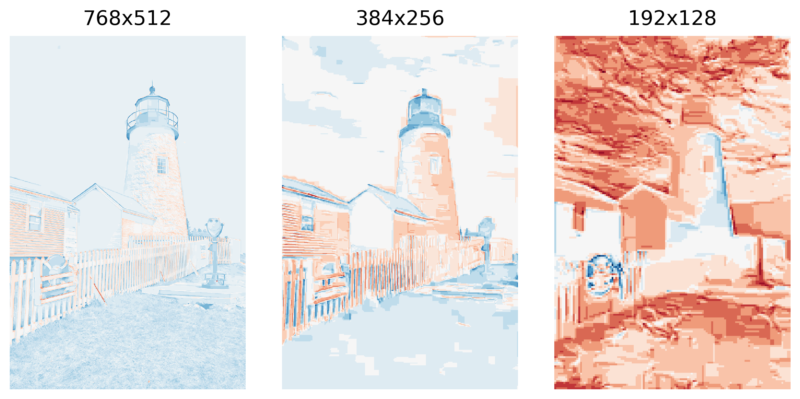
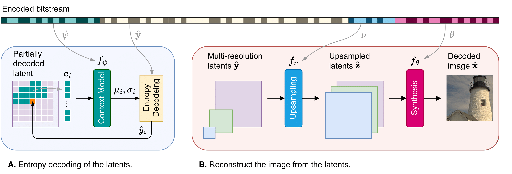
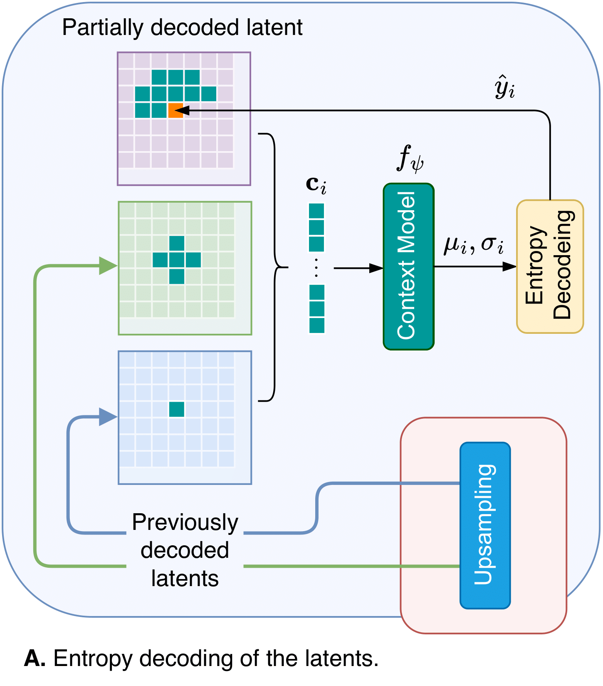
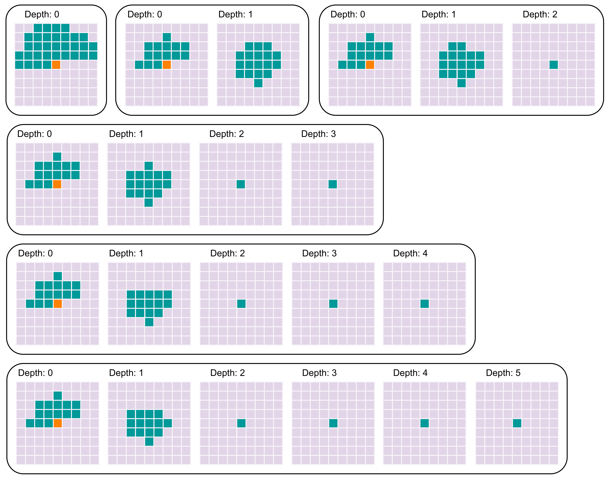

# Multiresolution Contexts for Implicit Neural Codecs

This repository contains the official implementation of Multiresolution Context Cool-Chic (MRC-Cool-Chic), a no complexity modification of the original Cool-Chic model for neural image and video compression based on overfitting.

In this project, we managed to increase the coding efficiency of Cool-Chic up-to -2.7% BD-rate on KODAK images while keeping the exact same low complexity characteristics of it.

We utilize multiresolution contexts to guide the training of the implicit neural codec towards better local minima.

# Motivation:

Cool-Chic is a state-of-the-art implicit neural codec that leverages an autoregressive model conditioned on neighborhood contexts to achieve high compression rates with low complexity. However, the original Cool-Chic model only uses neighborhood contexts from a single resolution latent, which may limit its ability to capture fine-grained details in the image. This can be seen in the latents learned by Cool-Chic, which tend to be very correlated between different stages. Here we show the top 3 resolution latents learned by Cool-Chic on a sample KODAK image:



# Novel Contribution:

The original Cool-Chic model uses a single stage context to condition the autoregressive model. In this work, we propose to use neighborhood contexts selected from different resolutions to better guide the training of the implicit neural representation. This simple modification allows us to achieve better rate-distortion performance without increasing the complexity of the model.

Here is a depiction of the original pipeline:


Our modification to the neighborhood context selection is as follows:


# Multiresolution Neighborhood Contexts:

We select neighborhood contexts from different resolution latents. Specifically, we upsample the original latents to the current latent's resolution using the learned upsampling modules from Cool-Chic. We then extract neighborhood contexts from these upsampled latents and concatenate them with the original neighborhood context.



# Citation

If you find this work useful in your research, please consider citing the following paper:

```
@inproceedings{dogaroglu2025multiresolution,
	author = {Dogaroglu, Hasan Burak and Wiedemann, Cari Emanuele and Steinbach, Eckehard },
	title = {Multiresolution Contexts for Implicit Neural Codecs},
	booktitle = {2025 Picture Coding Symposium (PCS 2025)},
	year = {2025},
  month = {Dec},
  language = {en},
}
```

# Thanks

We thank Theo Laduné et. Al. for open sourcing the amazing Cool-Chic repository to make this work possible. Please consider checking [their repository](https://github.com/Orange-OpenSource/Cool-Chic) and citing their work:

```
@InProceedings{Ladune_2023_ICCV,
    author    = {Ladune, Th\'eo and Philippe, Pierrick and Henry, F\'elix and Clare, Gordon and Leguay, Thomas},
    title     = {COOL-CHIC: Coordinate-based Low Complexity Hierarchical Image Codec},
    booktitle = {Proceedings of the IEEE/CVF International Conference on Computer Vision (ICCV)},
    month     = {October},
    year      = {2023},
    pages     = {13515-13522}
}
```
